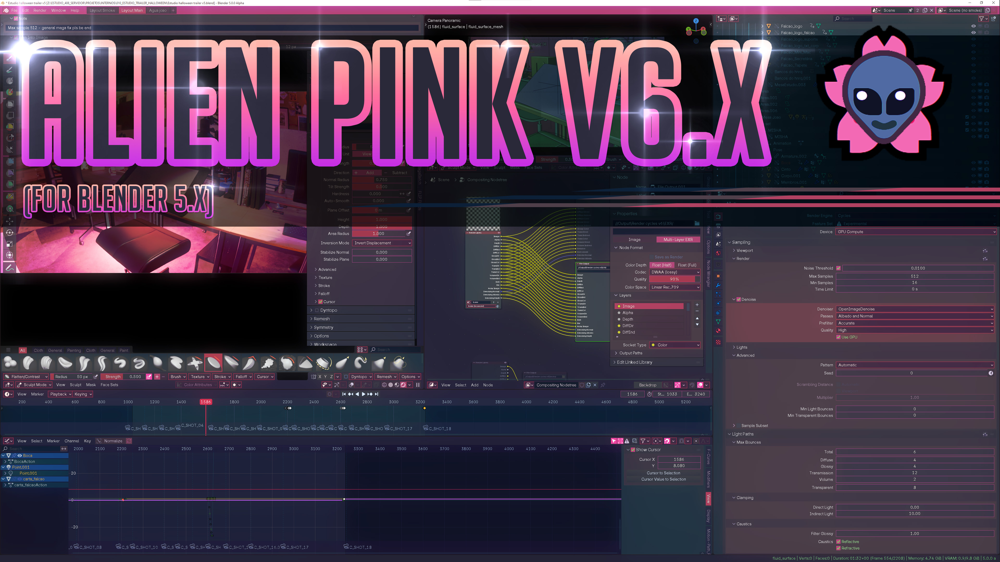

# Alien Pink 👽🌸 - Blender theme

## Description

If you're a fan a colourful themes, you're in for a treat!

Big thanks to [Miguel Pozo](https://github.com/pragma37) for making a [Theme Editor addon](https://app.gumroad.com/d/bd203ea14e1e159c47c00ecd11e2707f) which makes editing themes way more bearable 🙏

I'll add more documentation later, just download the latest version of the theme and you're good to go :)

## Download

Download the latest version of this theme in [Releases](https://github.com/Alumx/Alien-Pink-Blender-theme/releases)

(You only need the .xml file, ignore source code stuff)

## Update log

v6.0.0 [Release link](https://github.com/Alumx/Alien-Pink-Blender-theme/releases/tag/v6.0.0)
- Breaking update, only works for Blender 5.0.0 and forward, if you're using previous versions of blender please use latest version below v6
- This is first version of the theme, some things might look a bit different but its 90% usable (there are no huge visual discrepancies)
- Lowered intensity of header pink, its a lot more comfortable for the eyes
- Fixed Node header colors to use same color palette as previous versions of blender

v5.3.3 [Release link](https://github.com/Alumx/Alien-Pink-Blender-theme/releases/tag/v5.3.3)
- Altered bone color sets so that selected and active bones follow the same logic as rest of the theme (Orange=Selected and Green=Active) this should make it more obvious and intuitive which bones are currently selected and active
- Also enabled "Colored Constraints" for all color sets (seeing which bones have constraints is always useful)

v5.3 [Release link](https://github.com/Alumx/Alien-Pink-Blender-theme/releases/tag/v5.3)
- Small tweaks to keep things up to date with latest blender (4.2 alpha)
- added blender_manifest.toml to make this theme available on experimental blender [extensions page]([url](https://extensions.blender.org/themes/))

v5.2 [Release link](https://github.com/Alumx/Alien-Pink-Blender-theme/releases/tag/v5.2)
- Changed mesh selection from yellow to orange (unintended change)
  
v5.1 [Release link](https://github.com/Alumx/Alien-Pink-Blender-theme/releases/tag/v5.1)
- Changed bottom header from pink to dark blue (for better readability)
- Render bar is even *pinker* now
- NEW Dope sheet is now themed with colors accordingly!
- NEW Graph Editor is now themed with colors accordingly!
- NEW NLA editor is now themed with colors accordingly!
- Changed tool menus background from transparent to opaque (new blender feature, resizable dynamic islands!)
- Search in Properties is now themed!
- F3 search is now themed
- Changed Text Editor text select color from pink to blue (consistent text selection color everywhere else)
- And a lot of other small tweaks!

v5 [Release link](https://github.com/Alumx/Alien-Pink-Blender-theme/releases/tag/v5)
- Movie Clip Editor theme is fully implemented (Aong with Graph and Dopesheet subsections)
- Video Sequencer theming updated and improved
- Shader editor and Geometry Nodes now have grid dots!
- Spreadsheet is now colored
- Asset Browser is now colored
- Fixed a couple of spots where tabs weren't following the theme colors
